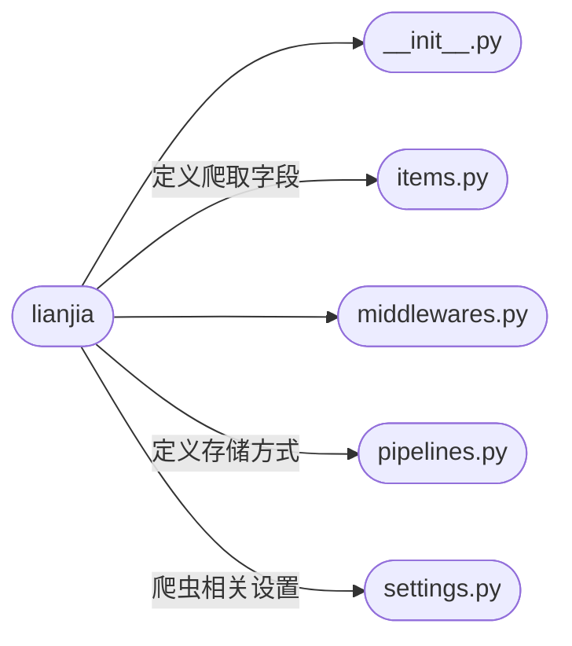

# 简介

本项目利用`Python`的`scrapy`框架爬取[链家网](https://sh.lianjia.com/zufang/)的上海市租房信息，利用`pandas`、`numpy`、`matplotlib`、`seaborn`、`folium` 、`wordcloud` 等库进行数据分析和可视化，通过`one-hot`编码和文本特征提取出120个训练特征，搭建3层神经网络对上海市租房价格进行预测。

# 模块介绍

## 爬虫

爬虫框架如下：

### items.py

爬取的字段如下表所示

| 字段名 | 字段中文 | 数据类型 |
| :-: | :-: | :-: |
