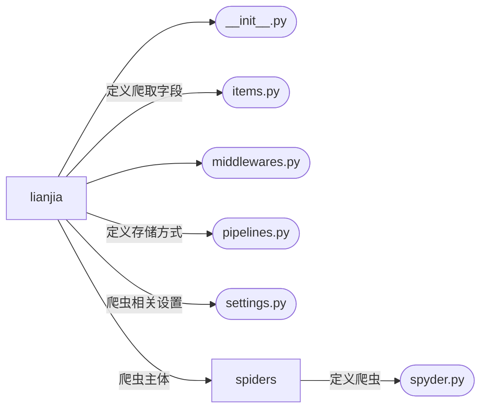

GitHub markdown渲染不完全，完整markdown见[利用神经网络预测链家网上海租房价格（Python）](https://blog.csdn.net/Mai_M/article/details/110978714)

# 简介

本项目利用`Python`的`scrapy`框架爬取[链家网](https://sh.lianjia.com/zufang/)的上海市租房信息，利用`pandas`、`numpy`、`matplotlib`、`seaborn`、`folium` 、`wordcloud` 等库进行数据分析和可视化，通过`one-hot`编码和文本特征提取出120个训练特征，搭建3层神经网络对上海市租房价格进行预测。

# 模块介绍

## 爬虫

爬虫框架如下：



### items.py

爬取的字段如下表所示

|  字段名  | 字段中文 | 数据类型 |
| :---------: | :----------: | :----------: |
|    title    |    标题    |     str     |
|  location  |    地点    |     str     |
| house_type | 房屋类型 |     str     |
| house_code | 房源编号 |     str     |
|    price    |    价格    |    float    |
|    tags    | 房源标签 |     str     |
|    lease    | 租赁方式 |     str     |
|    area    |    面积    |     str     |
| orientation |    朝向    |     str     |
|    floor    |    楼层    |     int     |
|  elevator  |    电梯    |     str     |
|    stall    |    车位    |     str     |
|    water    |    用水    |     str     |
| electricity |    用电    |     str     |
|  fuel_gas  |    燃气    |     str     |
|   heating   |    采暖    |     str     |
|  facility  | 配套设施 |     str     |
| description | 房源描述 |     str     |

### settings.py

这里有一些需要注意的一些设置：

* 定义编码，防止中文乱码

```python
	FEED_EXPORT_ENCODING = 'gbk'
```

* 定义日志文件。爬取过程会输出相当多的文字，定义日志可以保存输出结果，同时可以检查爬取过程

```python
LOG_FILE = 'lianjia.log'
```

* 忽略url重复。因为在爬取过程中，若严格忽略掉重复url，则只能爬到将近4000条数据 ==（不知道为什么）== 而忽略掉url重复，即所有url都爬，确实会爬到重复数据（可能是因为每次进入页面的租房信息是随机出现的），但可以爬全，只需在数据预处理时通过**房源编号**进行筛选即可

```python
DUPEFILTER_CLASS = 'scrapy.dupefilters.BaseDupeFilter'
```

* 定义自己的`user_agent`。若不定义，而去使用`scrapy`默认的字段，很容易就会被网站当成机器，无法继续爬取

```python
USER_AGENT = 'Mozilla/5.0 (Windows NT 10.0; Win64; x64) AppleWebKit/537.36 (KHTML, like Gecko) Chrome/86.0.4240.198 Safari/537.36'
```

* 不遵守机器爬取协议，以应对反爬措施

```python
ROBOTSTXT_OBEY = False
```

* 设置每次爬取的时间间隔，这个时间间隔通过多次实验得来，设置得再小一点就会被反爬，因此这是最小的时间间隔了……

```python
DOWNLOAD_DELAY = 2
```

### spyders/spyder.py

这里采用3层爬取结构，爬虫的结构如下所示


这里需要注意，以为链家网默认只显示100页，每页包含30条信息，但显示上海有17000+条租房信息，若直接遍历所有页进行爬取，则只能爬到最多3000条数据。而通过进一步进入各区的界面下后，最多也是显示100页，但累加起来后接近总的租房信息数量，因此在`parse`中要取得各区页面的`url`

## 房租预测

### 特征提取

利用神经网络构建模型，就需要进行特征提取，这里分别对3种类型数据进行处理和特征提取

| 变量类型 |    处理方式    |
| :----------: | :----------------: |
|  数值型  |     标准化     |
|  分类型  |   one_hot标签   |
|    文本    | TF-IDF特征提取 |

最终可以提取出120个特征

### 模型效果

MAE 在 0.08 ~ 0.09，即平均预测误差在800~900元


预测效果


